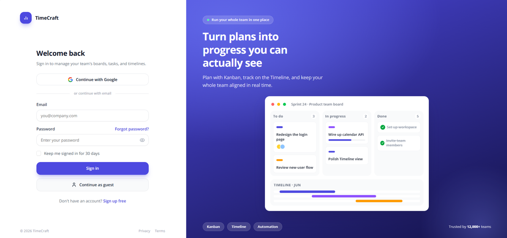
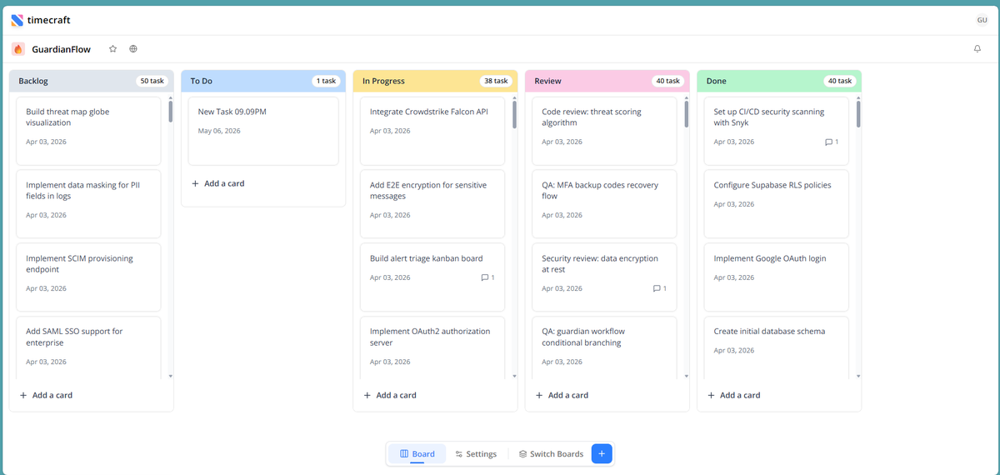

# TimeCraft

A real-time Kanban project management SaaS built with Next.js 16, React 19, and TypeScript.


## Features

- **Kanban Board** — Drag-and-drop columns and cards with smooth, conflict-free ordering
- **Real-time Collaboration** — Changes sync instantly across all project members
- **Optimistic UI** — Every action feels instant with automatic rollback on failure
- **Project Settings** — Animated slide-in panel for managing name, appearance, and tags
- **Multi-tenant** — Organizations with projects and members, each with role-based access control
- **Google OAuth** — Secure sign-in with session management and organization context
- **Soft Delete** — Safe column deletion with scheduled purge support

## Screenshots

**Login Page**


**Kanban Board**



## Tech Stack

| Layer | Technology |
|---|---|
| Framework | Next.js 16 (App Router), React 19 |
| Language | TypeScript 5 |
| Styling | Tailwind CSS v4, shadcn/ui, Framer Motion |
| State | Zustand 5 |
| Database | PostgreSQL (Supabase) via Drizzle ORM |
| Auth | NextAuth 4 — Google OAuth, JWT |
| Real-time | Pusher WebSocket |
| Drag & Drop | Atlaskit pragmatic-drag-and-drop |
| Package Manager | pnpm |

## Architecture

```
src/
├── app/
│   ├── (main)/        # Authenticated route group
│   │   └── project/   # Kanban board + settings panel
│   ├── api/           # REST API routes
│   └── login/         # Google OAuth login
├── store/             # Zustand global state
├── services/          # API service layer
├── db/                # Drizzle ORM schema & queries
├── components/        # UI components (shadcn/ui)
└── types/             # TypeScript type definitions
```

## Getting Started

### Prerequisites

- Node.js 20+
- pnpm
- Supabase PostgreSQL database
- Google OAuth credentials
- Pusher account

### Setup

```bash
pnpm install
pnpm db:push
pnpm dev
```

### Environment Variables

```env
DATABASE_URL=
GOOGLE_CLIENT_ID=
GOOGLE_CLIENT_SECRET=
NEXTAUTH_SECRET=
PUSHER_APP_ID=
PUSHER_KEY=
PUSHER_SECRET=
PUSHER_CLUSTER=
NEXT_PUBLIC_PUSHER_KEY=
NEXT_PUBLIC_PUSHER_CLUSTER=
```

### Commands

```bash
pnpm dev      # Start dev server (Turbopack)
pnpm build    # Production build
pnpm format   # Prettier + Tailwind class sorting
```
