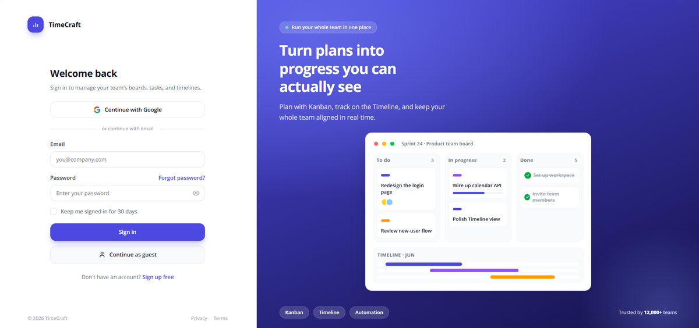
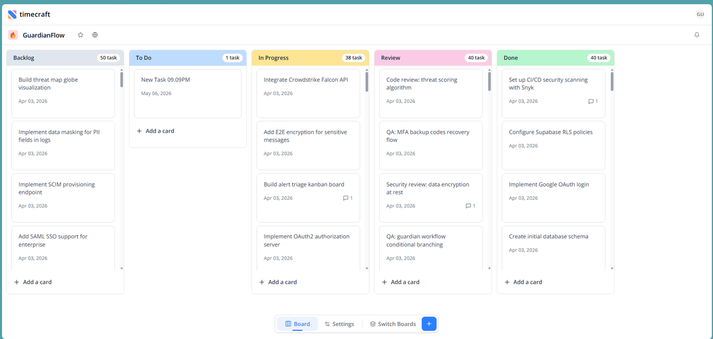

# TimeCraft

A real-time Kanban project management SaaS built with Next.js 16, React 19, and TypeScript.

[](https://github.com/noravutC/next-timecraft/actions/workflows/ci.yml)


## Features

- **AI Task Breakdown** — Type a goal and Claude streams it into actionable cards on the board
- **Kanban Board** — Drag-and-drop columns and cards with smooth, conflict-free ordering
- **Real-time Collaboration** — Changes sync instantly across all project members
- **Optimistic UI** — Every action feels instant with automatic rollback on failure
- **Project Settings** — Animated slide-in panel for managing name, appearance, and tags
- **Multi-tenant** — Organizations with projects and members, each with role-based access control
- **Google OAuth** — Secure sign-in with session management and organization context
- **Soft Delete** — Safe column deletion with scheduled purge support

## Screenshots

**Login Page**


**Kanban Board**



## Tech Stack

| Layer | Technology |
|---|---|
| Framework | Next.js 16 (App Router), React 19 |
| Language | TypeScript 5 |
| Styling | Tailwind CSS v4, shadcn/ui, Framer Motion |
| State | Zustand 5 |
| Database | PostgreSQL (Supabase) via Drizzle ORM |
| Auth | NextAuth 4 — Google OAuth, JWT |
| Real-time | Pusher WebSocket |
| Drag & Drop | Atlaskit pragmatic-drag-and-drop |
| Package Manager | pnpm |

## Architecture

```
src/
├── app/
│   ├── (main)/        # Authenticated route group
│   │   └── project/   # Kanban board + settings panel
│   ├── api/           # REST API routes
│   └── login/         # Google OAuth login
├── store/             # Zustand global state
├── services/          # API service layer
├── db/                # Drizzle ORM schema & queries
├── components/        # UI components (shadcn/ui)
└── types/             # TypeScript type definitions
```

## AI Task Breakdown — design notes

The board has an **AI breakdown** button: describe a goal, pick a column, and an LLM
turns it into cards that appear one by one as they are generated.

**Bring your own key, two providers.** Each user picks a provider — **Claude**
(`claude-opus-4-8`, official `@anthropic-ai/sdk`) or **Gemini** (`gemini-2.5-flash`,
official `@google/genai`) — and stores their own API key from the AI settings panel.
Keys are encrypted at rest (AES-256-GCM, `src/lib/ai/crypto.ts`) in the `ai_settings`
table and are never returned to the client — the API only reports whether a key is
set. A server-side `ANTHROPIC_API_KEY` acts as an optional shared fallback. Every
request writes a row to `ai_usage_logs` with the provider, model, input/output token
counts, task count, and outcome (`success` / `error` / `refusal`) — the raw material
for per-user usage dashboards and cost attribution.

**How it streams.** `POST /api/ai/task-breakdown` (session + RBAC-checked like every
other route) opens a streaming request to Claude and forwards results to the browser
as Server-Sent Events. The client inserts each subtask through the existing task
store, so AI-created cards get the same optimistic updates and Pusher broadcast as
manually created ones.

**Prompt design.** The system prompt instructs Claude to answer in **NDJSON** — one
`{"title", "description", "priority"}` object per line, ordered by execution order,
in the user's language. Each completed line is validated with Zod on the server;
lines that fail validation are silently dropped, so the client can never receive a
malformed task.

**Trade-offs considered.**
- *NDJSON vs. structured outputs (`output_config.format`)*: structured outputs give a
  schema-guaranteed document, but the guarantee applies to the whole response — you
  can't validate-and-forward items while the stream is still running without a
  partial-JSON parser. NDJSON keeps streaming trivial (split on newline) and moves the
  schema guarantee into per-line Zod validation instead.
- *Server-side vs. client-side task creation*: the server only proxies the AI; the
  client creates tasks through the normal `POST /api/task` path. This reuses the
  existing permission checks, optimistic store logic, and realtime broadcast instead
  of duplicating them inside the AI route.
- *Error handling*: rate limits / auth / network failures from the Anthropic SDK are
  mapped to human-readable SSE `error` events (the SDK already retries transient
  429/5xx twice with backoff). If the stream dies mid-way, the user keeps the cards
  that were already created — nothing is rolled back.

## Deployment

Two supported paths:

| Path | What it is | Guide |
|---|---|---|
| **Vercel** | Zero-config: connect the repo, set env vars, deploy | — |
| **Docker on AWS EC2** | Multi-stage image (`Dockerfile`, Next.js standalone output ≈ small runtime, non-root user, built-in `HEALTHCHECK` hitting `/api/health`) behind a Caddy HTTPS proxy | [docs/deploy-aws.md](docs/deploy-aws.md) |

For local container work there's a `docker-compose.yml` (app + Postgres 16):

```bash
cp .env.docker.example .env.docker   # fill in values
docker compose up --build
```

`GET /api/health` reports app + database status (`200 ok` / `503 degraded`) for
load balancers and uptime monitors. CI builds the production image on every PR.

## Observability

- **Structured logging** — every API request goes through the shared handler
  wrapper (`src/lib/api/handle.ts`) which emits one JSON log line via **pino**:
  method, path, status, duration, userId. Unhandled errors log with full stack.
  `docker logs timecraft` therefore yields grep-able JSON, ready for CloudWatch.
- **Error tracking (Sentry)** — DSN-gated: set `SENTRY_DSN` (server) and
  `NEXT_PUBLIC_SENTRY_DSN` (client) and both runtimes report unhandled errors,
  API 500s, and React render crashes (`global-error.tsx`). With no DSN the
  integration is a no-op. Source-map upload is intentionally not wired (it
  requires a build-time `SENTRY_AUTH_TOKEN`); stack traces are still useful
  because server code runs unminified in the standalone build.

## Getting Started

### Prerequisites

- Node.js 20+
- pnpm
- Supabase PostgreSQL database
- Google OAuth credentials
- Pusher account

### Setup

```bash
pnpm install
pnpm db:push
pnpm dev
```

### Environment Variables

```env
DATABASE_URL=
GOOGLE_CLIENT_ID=
GOOGLE_CLIENT_SECRET=
NEXTAUTH_SECRET=
PUSHER_APP_ID=
PUSHER_KEY=
PUSHER_SECRET=
PUSHER_CLUSTER=
NEXT_PUBLIC_PUSHER_KEY=
NEXT_PUBLIC_PUSHER_CLUSTER=
ANTHROPIC_API_KEY=   # optional — shared Claude fallback for AI Task Breakdown (users can bring their own key)
AI_ENCRYPTION_KEY=   # optional — dedicated secret for encrypting stored AI keys (falls back to NEXTAUTH_SECRET)
SENTRY_DSN=              # optional — server-side error tracking (off when empty)
NEXT_PUBLIC_SENTRY_DSN=  # optional — client-side error tracking (build-time on Docker)
LOG_LEVEL=               # optional — pino level, default "info"
```

### Commands

```bash
pnpm dev      # Start dev server (Turbopack)
pnpm build    # Production build
pnpm format   # Prettier + Tailwind class sorting
```
